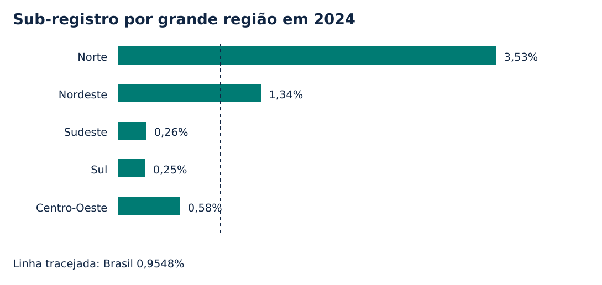

# Registro em Foco

**Dados públicos, pesquisa aplicada e instrumentos de planejamento para o acesso ao registro civil de nascimento.**

Este projeto investiga como diferenças territoriais de sub-registro podem orientar o monitoramento de políticas públicas. Reúne um artigo, um painel interativo, dados reproduzíveis e um dossiê inspirado nos eixos do Edital MDHC/PNUD BRA/23/024 nº 04/2026.

## Comece por aqui

- [Artigo completo em PDF](article/artigo.pdf)
- [Artigo em texto editável](article/artigo.md)
- [Plano de trabalho e diagnóstico](docs/01-plano-de-trabalho.md)
- [Proposta e matriz de monitoramento](docs/02-proposta-e-monitoramento.md)
- [Participação e subsídios institucionais](docs/03-participacao-e-subsidios.md)
- [Síntese executiva e comunicação](docs/04-sintese-e-comunicacao.md)

O painel está em `dist/index.html`: baixe o repositório e abra esse arquivo no navegador. Não requer servidor, conta, chave de API ou instalação para explorar os dados. O GitHub exibe o código HTML, não a aplicação; use a cópia local. Não há URL pública hospedada nesta versão.

## Resultados principais

| Medida | Resultado |
| --- | --- |
| Taxa nacional em 2022 | 1,3111% |
| Taxa nacional em 2024 | 0,9548% |
| Mudança em 2022–2024 | −0,3563 ponto percentual; −27,18% relativos |
| Maior taxa estadual em 2024 | Roraima: 13,8634% |
| Maior volume aproximado em 2024 | Pará: cerca de 3.331 eventos |
| Base municipal complementar | 5.570 registros; três com valores ausentes |

Fonte: IBGE, Tabela 1.1 de cada ano e Tabela 1.2 de 2024. Arquivos de 2022 e 2023 revisados em junho de 2026. **Volume aproximado = total estimado de nascimentos × taxa / 100. Não é uma contagem de pessoas identificadas.**



## O que o painel faz

- Seleção de Brasil ou UF e ano de referência.
- Série de 2022 a 2024 com comparação nacional.
- Ordenação estadual por taxa ou volume aproximado.
- Cenário de redução anual configurável, explicitamente hipotético.
- Exportação do território selecionado e download da base municipal.
- Acesso ao artigo e ao dossiê em HTML.

## Reproduzir a análise

Python 3.10 ou superior. Em um ambiente virtual:

```sh
python -m pip install -r requirements.txt
python scripts/build_data.py
python -m unittest discover -s tests -v
```

O processamento padrão usa os três ZIPs originais versionados em `data/raw`. Para baixar novamente as mesmas versões:

```sh
python scripts/build_data.py --download
```

O download compara hashes e interrompe se a fonte mudou. Uma nova edição exige revisão e atualização deliberada do manifesto, da análise e do artigo. O texto do artigo é autoral e **não se atualiza automaticamente** quando novos dados são incorporados.

Para reconstruir PDF e páginas de leitura:

```sh
python scripts/build_publications.py
```

As figuras PNG estão versionadas. Para regenerá-las, instale Poppler e informe `--poppler /caminho/para/pdftoppm`. A opção `--docx` gera uma versão Word opcional, que exige revisão visual própria antes de uso; ela não integra a entrega validada. O artigo entregue está em PDF, Markdown e HTML.

Para servir o painel localmente, se preferir:

```sh
python -m http.server 8000 --directory dist
```

Abra `http://localhost:8000`. O painel também funciona diretamente pelo arquivo, pois os dados estaduais são incluídos em um recurso local, sem chamadas remotas.

## Organização

```text
article/         artigo, PDF e figuras
data/raw/        ZIPs públicos originais
data/processed/  CSVs e resumo calculado
data/sources.json  URLs, versões e hashes
dist/            painel e publicações para navegador
docs/            dossiê e dicionário
scripts/         extração e geração das publicações
src/             funções analíticas
tests/           integridade, cálculos e links
```

## Limites de interpretação

Sub-registro anual de nascimentos não é o estoque de pessoas sem documentos. A análise não estima causalidade, não demonstra efeito de intervenções e não classifica gestores. As tabelas não permitem localizar pessoas. A simulação não é previsão ou meta oficial. Dados administrativos, consulta pública e validação institucional não foram realizados ou coletados pelo projeto. Os exemplos participativos são identificados como fictícios.

As diferenças entre territórios não são tratadas como estatisticamente significativas. O uso operacional das medidas requer análise contextual e atenção a incerteza e denominadores pequenos.

## Fontes e autoria

Os links completos estão no [artigo](article/artigo.md) e no [manifesto](data/sources.json). Consulte o [dicionário](docs/dicionario.md) para unidades, ausências e categorias.

Projeto de portfólio de **Osmarsrjunior**, elaborado com assistência de inteligência artificial na programação e redação. Não submetido a avaliação por pares. Sem vínculo ou endosso de IBGE, MDHC, PNUD ou TCU. A inspiração em um edital não representa execução contratual nem comprovação de experiência profissional exigida em seleção.

Código sob [licença MIT](LICENSE). Textos e figuras originais sob CC BY 4.0, conforme [licenças de conteúdo](LICENSE-CONTENT.md). Dados do IBGE mantêm a atribuição e os termos da fonte original.
